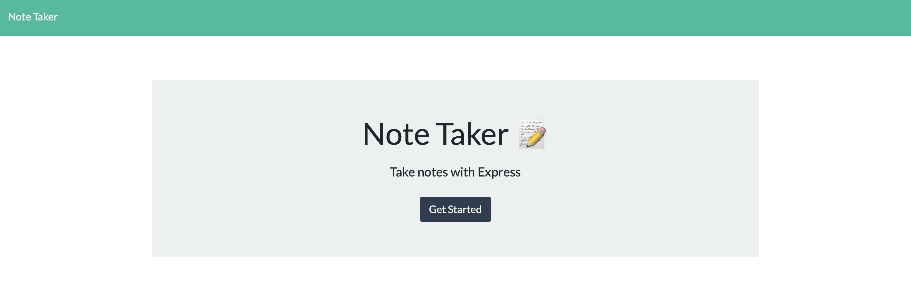

# 11 Express.js: Note Taker

# note-Taker

## Table of Contents
* [Intro](#intro)
* [Demo](#demo)
* [Sample](#sample)
* [Development](#development)
* [Installations](#installations)
* [Created by](#created-by)
* [Repository](#repository)
* [Deployment](#deployment)
* [License](#license)

 ## Introduction
An application that can be used to write, save, and delete notes. This application uses an express backend and can save and retrieve note data from a JSON file.

## Demo

## Sample 
 These are samples of the note-Taker application. 
 

 

## Development

### Bootstrap
* [Bootstrap](https://getbootstrap.com/)
  * Bootstrap was used for layout and mobile responsivess

## Installations
Type the following npm install commands one at a time: npm i, npm install jest, npm install inquirer in the command line while in the teamProfileGenerator folder. 

* [npm](https://docs.npmjs.com/cli/v7/commands/npm-install)
  * npm is the package manager for the Node JavaScript platform. 

* [express](https://www.npmjs.com/package/express)
  * Allows to dynamically render HTML Pages based on passing arguments to templates.

* [uuid](https://www.npmjs.com/package/uuid)
  * (Universally unique identifier) uuid package helps create unique ids and attach it with user information and save to the database.
 
* [path](https://www.npmjs.com/package/path)
  * The Path module provides a way of working with directories and file paths. 

## Created by
* [Javiann Marrero](https://github.com/javiistacks)

## Repository
### Github Repository
Repository at [note-Taker](https://github.com/javiistacks/note-Taker)

## Deployment
### Heroku
Deployment at [note-Taker](https://arcane-beyond-29314.herokuapp.com)

## License

Copyright (c) Javiann Marrero. All rights reserved. 
Please be kind and change content if you wish to use this code.

Licensed under the MIT License

Copyright (c) 2021 - present | Javiann Marrero

<blockquote>
Permission is hereby granted, free of charge, to any person obtaining a copy
of this software and associated documentation files (the "Software"), to deal
in the Software without restriction, including without limitation the rights
to use, copy, modify, merge, publish, distribute, sublicense, and/or sell
copies of the Software, and to permit persons to whom the Software is
furnished to do so, subject to the following conditions:

The above copyright notice and this permission notice shall be included in all
copies or substantial portions of the Software.

THE SOFTWARE IS PROVIDED "AS IS", WITHOUT WARRANTY OF ANY KIND, EXPRESS OR
IMPLIED, INCLUDING BUT NOT LIMITED TO THE WARRANTIES OF MERCHANTABILITY,
FITNESS FOR A PARTICULAR PURPOSE AND NONINFRINGEMENT. IN NO EVENT SHALL THE
AUTHORS OR COPYRIGHT HOLDERS BE LIABLE FOR ANY CLAIM, DAMAGES OR OTHER
LIABILITY, WHETHER IN AN ACTION OF CONTRACT, TORT OR OTHERWISE, ARISING FROM,
OUT OF OR IN CONNECTION WITH THE SOFTWARE OR THE USE OR OTHER DEALINGS IN THE
SOFTWARE.
</blockquote>

